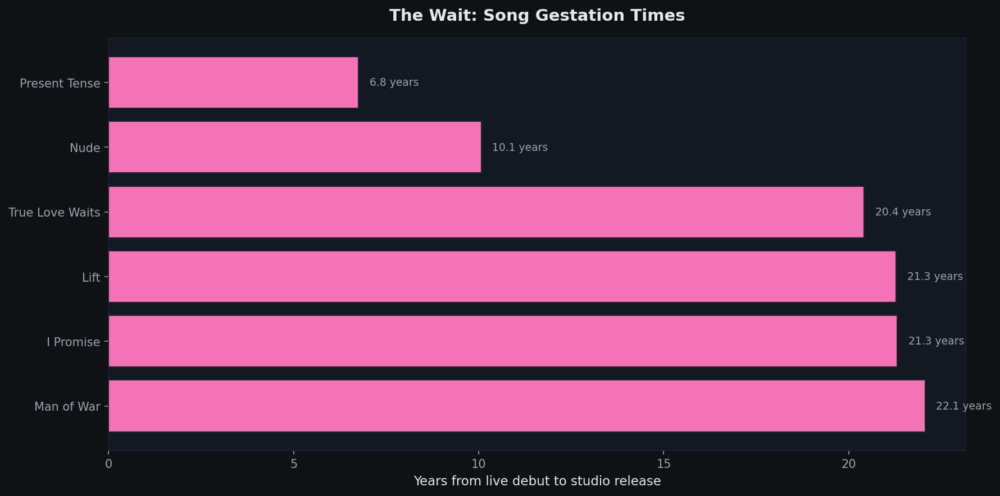
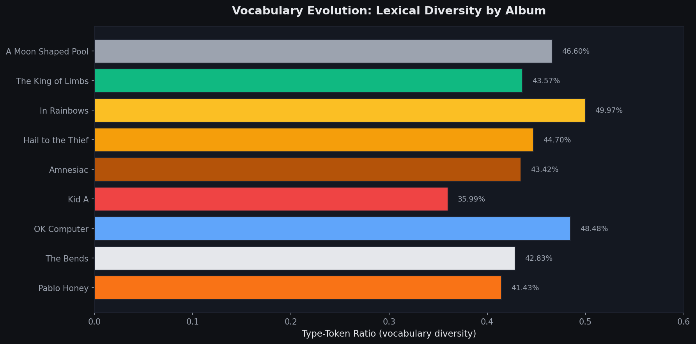
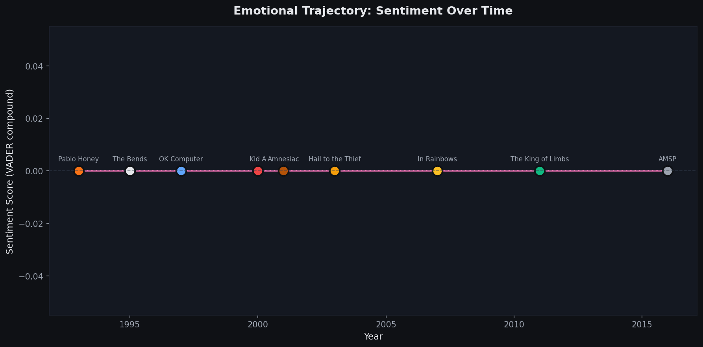
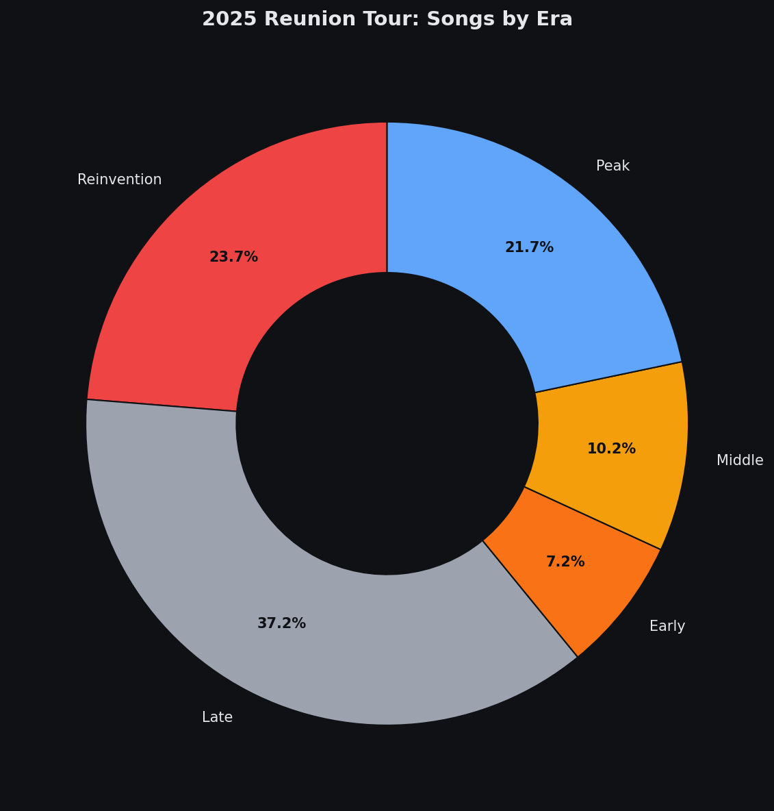

# Radiohead Data Lab

[](https://python.org)
[](https://react.dev)
[](https://www.kaggle.com/datasets)
[](LICENSE)

_Everything in its right place._

<p align="center">
  
  
  
  
  
</p>

---

## Context: The 2025 Reunion

After seven years of silence, Radiohead returned to the stage in November 2025 for a 20-date European tour. They played in the round for the first time since 1993, drawing from a 65-song pool that Thom Yorke compiled for rotating setlists. The tour came after years of grief, mental health struggles, and uncertainty about whether the band would ever perform together again.

This project explores the patterns in their music that brought fans back.

## The Central Question

Critics and fans often describe Radiohead's trajectory in familiar terms: the band became "colder," "more abstract," and "emotionally detached" after OK Computer. Kid A is treated as a clean break—a band abandoning warmth for alienation.

But is any of that actually true in the lyrics, or are we conflating sonic texture with thematic content? Did the words change, or just the sounds around them?

This project quantifies what "cold" and "detached" actually mean, then tests whether the data supports the narrative.

## The Discography

| Era         | Album              | Year | Narrative                                  |
| ----------- | ------------------ | ---- | ------------------------------------------ |
| Early       | Pablo Honey        | 1993 | Raw, unformed, Creep-dependent             |
| Early       | The Bends          | 1995 | Anthemic, emotional, guitar-driven         |
| Peak        | OK Computer        | 1997 | Paranoid, sprawling, the "last rock album" |
| Reinvention | Kid A              | 2000 | Cold, fractured, electronic alienation     |
| Reinvention | Amnesiac           | 2001 | Kid A's darker twin, jazz-inflected        |
| Middle      | Hail to the Thief  | 2003 | Political, dense, return to guitars        |
| Late        | In Rainbows        | 2007 | Warm, direct, romantic                     |
| Late        | The King of Limbs  | 2011 | Rhythmic, skeletal, loop-based             |
| Late        | A Moon Shaped Pool | 2016 | Orchestral, mournful, retrospective        |

## Hypotheses

**H1: The "coldness" narrative is overstated.**
Kid A's reputation as emotionally distant may be driven more by its production than its lyrics. Sentiment analysis and emotion classification will test whether the lyrical content actually shifted, or whether critics projected the sonic palette onto the words.

**H2: Vocabulary fragmentation increased, not negativity.**
Thom Yorke's later lyrics feel different because they're structurally fragmented, not because they're sadder. Metrics like lexical diversity (type-token ratio), average sentence length, and repetition ratios may explain the "abstract" feeling better than sentiment alone.

**H3: Thematic clustering reveals more continuity than change.**
Topic modeling and keyword overlap across albums will test whether Radiohead's core concerns (technology, isolation, identity, decay) remain stable even as delivery changes. The hypothesis is that the band's thematic DNA is more consistent than the "reinvention" narrative suggests.

**H4: In Rainbows is the outlier, not Kid A.**
Conventional wisdom treats Kid A as the pivot point. But In Rainbows may represent a larger emotional shift—a return to directness that breaks from the Kid A through Hail to the Thief period. The data will show which album is the true statistical outlier.

## Results

### The Coldness Test (H1)

**Result: H1 Supported.** No statistically significant difference in lyrical coldness between Kid A and earlier albums. The "cold" reputation appears driven by production, not lyrics.

<p align="center">
  
</p>

### The Wait

True Love Waits existed for 21 years as a live-only track before appearing on A Moon Shaped Pool in 2016. Twenty-one years of waiting to release a song called "True Love Waits," and when they finally did, it was a goodbye.

<p align="center">
  
</p>

### Vocabulary Evolution (H2)

Type-token ratio (lexical diversity) increases in later albums and average sentence length is slightly shorter, while sentiment remains flat. This supports H2: the lyrics "feel different" because of structural fragmentation, not increased negativity.

<p align="center">
  
</p>

### Thematic Continuity (H3)

Keyword overlap across album-level top terms is modest (avg ~0.05; adjacent albums ~0.05). A small set of terms recur in at least 4 albums (e.g., want, back, never, around, little). LDA topic modeling runs when scikit-learn is available, and is exported alongside the overlap results.

### Emotional Trajectory

Sentiment over time across the discography, with each album represented by its Donwood-inspired color.

<p align="center">
  
</p>

### 2025 Tour: Setlist Archaeology

Based on 12 recorded setlists from a 20-date tour, the reunion shows drew heavily from the Late era (37%) and Reinvention era (24%), with True Love Waits appearing in every recorded show.

<p align="center">
  
</p>

## Project Structure

```
radiohead-lab/
├── assets/                          # Album artwork for README
├── data/
│   ├── raw/
│   │   ├── new_data_1.csv           # Kaggle lyrics dataset (100 tracks)
│   │   ├── live_debuts.json         # Song live debut dates
│   │   └── tour_2025_setlists.json  # 2025 reunion tour setlists
│   ├── processed/                   # Cleaned datasets
│   └── exports/
│       ├── radiohead_complete.json  # Enriched track-level dataset
│       └── radiohead_with_audio.json # Placeholder for Spotify features
├── src/
│   ├── scrapers/
│   │   ├── lyrics_scraper.py        # Genius API
│   │   ├── audio_features.py        # Spotify API
│   │   └── setlist_scraper.py       # setlist.fm for 2025 tour
│   ├── processing/
│   │   ├── ingest_csv.py            # CSV data ingestion
│   │   ├── feature_extraction.py    # Lexical stats + sentiment
│   │   └── export_for_web.py        # Web data export pipeline
│   ├── analysis/
│   │   ├── sentiment.py             # 8 emotion categories + coldness
│   │   ├── lexical_diversity.py     # Type-token ratio analysis
│   │   ├── topic_modeling.py        # LDA topic extraction
│   │   ├── hypothesis_tests.py      # H1-H4 statistical tests
│   │   ├── the_wait.py              # Live debut to studio timelines
│   │   └── setlist_archaeology.py   # 2025 tour analysis
│   └── visualization/
│       └── generate_figures.py      # Static figure generation
├── web/
│   ├── src/
│   │   ├── components/
│   │   │   ├── AlbumExplorer.jsx    # Album browser with era theming
│   │   │   ├── SentimentTimeline.jsx # Coldness test visualization
│   │   │   ├── LyricAnalyzer.jsx    # Song search + emotion profiles
│   │   │   ├── TrueLoveWaits.jsx    # 21-year wait story
│   │   │   └── ReunionTour2025.jsx  # Tour setlist archaeology
│   │   ├── data/
│   │   │   ├── radiohead_complete.json
│   │   │   └── radiohead_web_data.json
│   │   ├── styles/
│   │   │   └── donwood.css          # Donwood-inspired theming
│   │   └── App.jsx
│   ├── public/
│   └── package.json
├── results/
│   └── figures/                     # Generated PNG charts
├── requirements.txt
└── README.md
```

## Visual Language

The web experience shifts palettes based on Stanley Donwood's artwork for each album era:

| Album              | Palette                          | Texture               |
| ------------------ | -------------------------------- | --------------------- |
| The Bends          | Clinical whites, medical imagery | Sterile, unsettling   |
| OK Computer        | Washed blues, highway grays      | Smeared, ghostly      |
| Kid A              | Reds, mountain whites            | Jagged, digital decay |
| Amnesiac           | Sepia, minotaur blacks           | Labyrinthine          |
| Hail to the Thief  | Map colors, dense text           | Cartographic chaos    |
| In Rainbows        | Spectrum explosion               | Layered, warm         |
| The King of Limbs  | Forest greens, newspaper         | Organic, fragmented   |
| A Moon Shaped Pool | Muted, ash, water                | Grief, dissolution    |

## Stack

**Analysis**
- Python 3.11+
- NumPy, SciPy, scikit-learn
- vaderSentiment, matplotlib

**Web**
- React 18, Vite
- Custom CSS (Donwood-inspired palettes)

## Usage

**Run the web app:**
```bash
cd web && npm install && npm run dev
```

**Run analysis modules:**
```bash
python -m src.analysis.hypothesis_tests
python -m src.analysis.the_wait
python -m src.analysis.setlist_archaeology
```

## Known Limitations

- Spotify audio features unavailable (API returns 403 with client credentials)
- Setlist data manually compiled from public fan archives (12 recorded shows)
- Topic modeling uses LDA when scikit-learn is available; otherwise keyword overlap is used

## Data Sources

- `data/raw/new_data_1.csv` — Kaggle lyrics dataset (100 tracks, 9 albums)
- `data/raw/live_debuts.json` — Song live debut dates (compiled from setlist.fm/Citizen Insane)
- `data/raw/tour_2025_setlists.json` — 2025 reunion tour setlists

---

*For educational and analytical purposes only. Built as a tribute to Radiohead's 2025 reunion. Album artwork shown under fair use for commentary. All music, lyrics, and artwork remain the property of Radiohead and their respective rights holders.*
